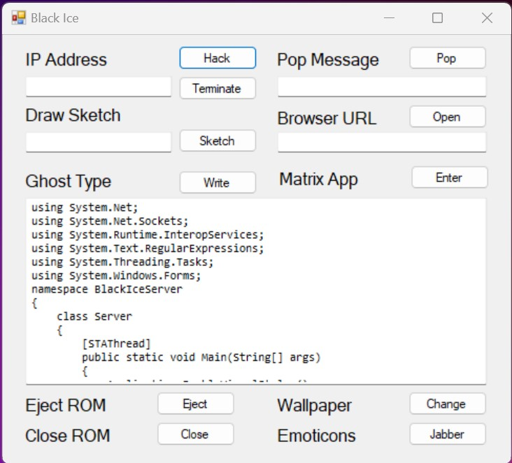

# Black Ice

This is a fun "hacking" project that involves two machines (client and server) over TCP/IP.

The server listens to the client's command such as ejecting the optical drive, changing the screensaver, or popping random images and websites.

## To run

1. Build both the client and server code.
1. Run the server binaries on the hacked computer.
1. Run the client binaries on the hacking computer.
1. On the server, use the user interface to send out commands for the client to intercept. Make sure to specify the network IP address.

## Demo

1. Run both the server and client on your computer
1. Get the IP address (e.g ipconfig or ifconfig)
1. Put the IP address on the field of the client
1. Now that the handshake has been established, try to run a few hacked programs like Matrix and Ghost.
